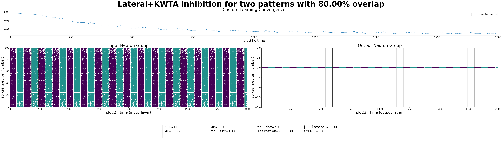

# Neural Learning Mechanisms and Simulations

## Project Overview

In this project, we aimed to explore and implement various neural mechanisms within a single-layer neural network. Our primary objectives were to understand the existing interactions between neurons and to analyze how these interactions affect the learning process. We conducted a series of experiments to simulate different neural network behaviors and training methodologies.

## Objectives

1. **Understand Neural Interactions**:  
   We focused on familiarizing ourselves with the mechanisms between neurons within a single layer.

2. **Evaluate Learning Impact**:  
   We investigated the impact of these mechanisms on the learning process.

## Activities

Our project consisted of the following activities and experiments:

### 1. Basic Neural Network Simulation

- **Setup**:  
  We created a basic spiking neural network with one input layer and one output layer containing two neurons.

- **Connection**:  
  We ensured that all input neurons were connected to all output neurons.

- **Training**:  
  We used Spike-Timing Dependent Plasticity (STDP) to train the weights of the connections.

### 2. Advanced Mechanisms

- **Lateral Inhibition**:
  - We added lateral inhibition to the second layer.
  - We trained the network using two different stimuli.
  - We analyzed whether the two neurons in the second layer became sensitive to different stimuli.

- **Experiment with Stimulus Variation**:
  - We repeated the above experiment with varying degrees of overlap between the stimuli.
  - We reported the results.
    - Results:
      - The result for 2 patterns with 0 percent overlap is as follows:
        - 
        - 
      - The model can rationally distinguish a maximum of two input stimuli. Comparing results are available in `comparing_methods` file.
        - 

- **k-Winners-Take-All**:
  - We added a k-Winners-Take-All mechanism to the second layer.
  - We trained the network with different stimuli.
  - We reported the results and compared them with previous experiments.
    - Results:
      - The result for 2 patterns with 80 percent overlap is as follows:
        - 

### 3. Combined Mechanisms

- **Integration of Mechanisms**:
  - We created a simulation incorporating both Lateral Inhibition and k-Winners-Take-All mechanisms.
  - We added a Homeostasis mechanism to the second layer, which included at least five neurons.
  - We trained the network and reported the results.

    - Results: Although the model's performance using only KWTA and lateral inhibition is not very significant, we can greatly improve the performance by using both simultaneously
      - The result for 5 patterns with 0 percent overlap is as follows:
        - train:
      - However, even when combined, these two methods aren't strong enough to differentiate between 20 stimuli.:
        - train: 
        - test: 

- **Neuron Variation**:
  - We experimented by changing the number of neurons in the second layer (both less than and more than the number of input stimuli).
  - We compared the extracted features and their impact on learning.
    - Some of results:
      - Result for 5 input neurons and 4 output neurons. Model can not learn inputs.:
        - train: 
        - test: 
      - Result for 5 input neurons and 10 output neurons with k=2 for KWTA, model tries to assign 2 output neurons to each input.:
        - train: 
        - test: 

### 4. Parameter Exploration

- **Parameter Variation**:
  - We investigated the effects of different parameters on learning for the above simulations.
  - We reported how each mechanism affected the learning process.

### 5. Homeostasis Exploration

- **Homeostasis Mechanism**:
  - We added a Homeostasis mechanism to the second layer to maintain a balance of neuron activity.
  - We included at least five neurons in this layer to observe the effects on learning and network stability.
  - We trained the network and analyzed the impact of Homeostasis on the learning process.
    - **Result**: When we combine all three methods in our model, it can not only distinguish different patterns but also differentiate up to 50 stimuli."
      - train for 20 input patterns: 
      - testfor 20 input patterns: 
      - train for 50 input patterns: 
      - testfor 50 input patterns: 

## Results

We summarized the findings from each experiment, highlighting key insights and how they contributed to our understanding of neural mechanisms and learning processes.

## Conclusion

We reflected on the success of the different mechanisms in achieving our project's objectives, discussing any limitations and potential areas.

For project reports or further inquiries, please reach out to me at [amiraliamini@ur.ac.ir 📨](mailto:amiraliamini@ur.ac.ir).
